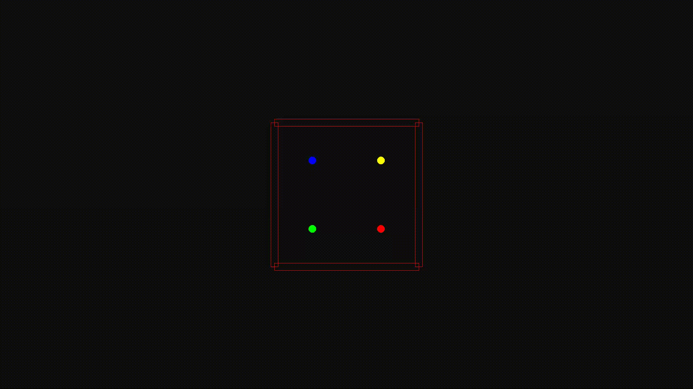

# rapier_examples
Demonstration of using the [Rapier 2D](https://rapier.rs/) physics engine, without using Bevy.
Using an input format (in JSON) you can setup a scene then run the simulation and render
it to a video output. There is a Docker file and build script if using Windows and don't
want to install FFMPEG (which can be hard on Windows), which are required by the `openh264`
crate.



### Running the Application on Computer
To run the application you need to specify the input file (although there is a default). eg.

```rust
./rapier_examples -f "inputs/box.json" -m 2000 -d
```

Or from Cargo, using the longform args

```rust
cargo run -- --file "inputs/box.json" --max-frames 2000 --debug
```

You can also specify the output filename (without the file extension).

```rust
cargo run -- -o "output_filename"
```

### Running the Application on Docker
There is a build script which will build the image in Docker and pull
the rendered image out - where it will store it in `data/outputs`. To
run the script use:

```bash
./run_build.sh
```

Or pass in any build arguments as a quoted string:

```bash
 ./run_build.sh "-d --max-frames 500 --file inputs/convergent_users.json"
```

The format of arguments is the same as though building on the host
machine.

### File layout
The input file is a JSON consists of an array of `Blocks` and `Users`. 
A `Block` object looks like this:

```json
{
    "Location": {
        "X": 10.0,
        "Y": 0.0
    },
    "Scale":{
        "X": 1.0,
        "Y": 20.0
    }
}
```

A user object is also required to enact an animation by specifying
the forces on that object. This looks as follows:

```json
{
    "Location": {
        "X": 0.0,
        "Y": 0.0
    },
    "Rotation": 3.1412,
    "Power": 1.0,
    "Color": {
        "R": 255,
        "G": 0,
        "B": 0
    }
}
```